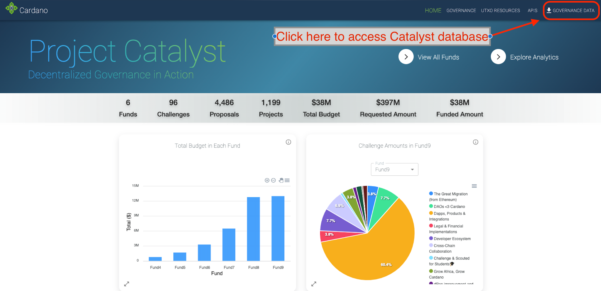
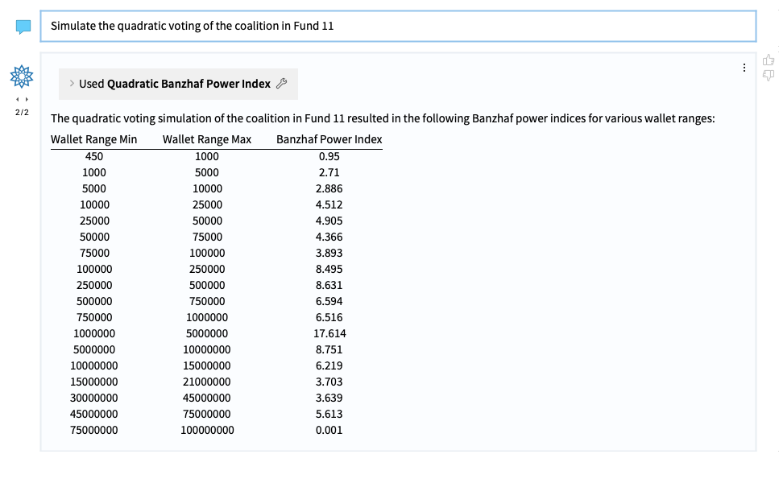

# Wolfram: The AI Revolution and Implications to Project Catalyst 
# Milestone 2: Content Collection and Curation

## Introduction
### Background: Researching LLM with Guided Participation

Our research for this milestone centers around a community-driven question; “what resources are needed to assist a Catalyst community member with the ability to enable an AI chatbot workflow?” How can Wolfram Blockchain Labs (WBL) provide as much and as close to a step-by-step guidance through the Catalyst governance process to understand how LLMs work? Various additional questions include; what data is useful, where can I find it, how much will it cost to implement, what structure should the data take, etc. Critically, this is a reminder that the process WBL is taking is not the creation of an AI chatbot or AI Assistant for Catalyst. That would be an enormous undertaking at this point in time. Rather, this project is to conduct significant research and exploration to see if the useful creation of an assistant is possible—by investigating novel approaches, proofs of concept, and use cases—and if so, how to keep the operational costs low enough to provide a significant return on investment for the Catalyst community to endeavor forward. Because this project is fully open source, we believe leading this research effort would establish a strong precedent for community actors to get up to speed and build from there. The objective of this research is twofold: 1) to explore the feasibility of providing users with support throughout the stages of proposal submission, evaluation, voting and management, and 2) to understand the preferred implementation approach according to the community's needs, ethos and perspectives. This includes content curation, resource gathering, and workflow processes documented. This particular report includes that information. Lastly, and again, it's important to note that this proposal does not encompass the actual implementation of the LLM assistant, but a guide and workflow for it.

### Milestone 2: Content Collection & Curation 

There have now been 11 Project Catalyst funds, and WBL has curated collections of past proposals in as much detail as possible. We have collaborated with other teams in the space, including LidoNation and MinSwap, in order to create a more robust dataset of the full catalyst proposals and accompanying data. However, for this specific use case, we attempted to curate all historical proposals and build them into a start to finish workflow. That workflow is included here, but there are still gaps in the full curation of content (as there may always be gaps). Because this is an evolving ecosystem, at each point in time there will be new rules and new additions to the Catalyst Governance process which change or supersede previous iterations, templates, standards, and datasets. So far, there has not been a definitive standard to the Catalyst proposal process, which makes combining and merging previous datasets into one coherent whole very difficult. This is an ongoing process, and it forms the basis for a more formal request from the Catalyst team to receive full, clean and structured proposal data from the Catalyst team. 
Additionally, we must gather as much instructional content related to participating in different roles within Catalyst, like proposer, voter, reviewer, and management. It is likely that we will need to develop a significant amount of new material on how to engage in Catalyst, as a DRep or as an AI agent, for which we’ve hosted a meeting with several Catalyst leaders in the space (video here). Initial assessments reveal that we can’t assume instructional data in training sets of LLMs from commercial entities has resulted in validated or trustworthy data regarding Project Catalyst. Therefore, our workflow uses LLM functionalities built into the Wolfram Language in the loop of exploring SQL databases to ultimately return verified, factual information based on the data that has been collected within Project Catalyst, historically speaking. Ultimately, curating data/content and developing a workflow with context and understanding of the various aspects of the Catalyst landscape is pivotal in LLM-based assistance research. Please see the following instructions for more information on the available workflow.
## Available Data
1. Navigate: https://www.wolframblockchainlabs.com/dashboard/
2. Click here in the top right corner:

3. Click on “Wolfram Governance Data”, the first link in the drop down menu.
4. Download and unzip file to access the “Cadano_SQL” data.
### Exploring the Database
1. Topologically, here is the database diagram: https://dbdiagram.io/d/Cardano-Governance-Database-655ddcf53be14957878114c7
2. Screenshot of database diagram:

3. Here are the descriptions of the database diagram:
### Explanation of Database
### Wolfram Governance Data - Tables and Fields
1. Fund: This table stores information about different funds launched by Project Catalyst.
- fund_id (integer): Unique identifier for the fund.
- fund_name (text): Name of the fund.
- launched_date (date): Date when the fund was launched.
- start_date (date): Date when the fund started accepting proposals.
- launched_month (text): Month when the fund was launched.
- start_month (text): Month when the fund started accepting proposals.
- launch_guide (text): URL for the launch guide of the fund.
- official_results (text): URL for the official results.
- voting_results (text): Stores voting results information.
2. Challenge: This table categorizes proposals within a fund.
- challenge_id (integer): Unique identifier for the challenge.
- challenge_name (text): Name of the challenge.
- fund_id (int): References the fund.
- description (text): Description of what proposals should address.
- challenge_url (text): Ideascale URL of the challenge.
- challenge_amount (bigint): Budget allocated for the challenge.
- number_of_proposals (int): Number of proposals submitted.
- is_challenge_setting (boolean): Indicates if this is a setting challenge.
3. Proposals: Contains proposals submitted for funding in each challenge.
- proposal_id (int): Unique identifier for the proposal.
- challenge_id, fund_id (int): References to challenge and fund.
- title (text): Title of the proposal.
- description (text): Detailed proposal description.
- user_id (int): References the proposer.
- rating (double): Overall proposal rating.
- no_assessments (int): Number of assessments received.
- url (text): Ideascale URL of the proposal.
- amount_requested (int): Funding amount requested.
- solution, experience (text): Provided solution and proposer's experience.
- is_challenge_proposal (boolean): Indicates if part of a challenge setting.
4. Voting Results: Tracks voting and status of proposals.
- proposal_id (int): References the proposal.
- overall_score (real): Overall score from reviewers.
- yes, no (integer): Upvotes and downvotes.
- result (integer): Overall votes received.
- meets_approval_threshold, status (boolean): Approval status and funding status.
- reason_not_funded (varchar): Reason if not funded.
- fund_depletion (bigint): Remaining funds after decision.
- sponsored_by_leftovers (boolean): If funded by leftover funds.
5. Project Status: For tracking funded projects.
- project_id (int): Unique project identifier.
- proposal_id (int): References the funded proposal.
- project_completed, project_on_track (boolean): Completion and tracking status.
- project_status_description (varchar): Status description.
- expected_completion_date, completed_date (date): Expected and actual completion dates.
- evidence, notes, final_report, final_video (text): Documentation of project progress and completion.
- amount_requested, amount_distributed, amount_remaining (int): Financial tracking.
6. User: Details on users involved in the governance process.
- user_id (int): Unique user identifier.
- user_name (varchar): Username.
- role_id (int): References the user's role.
7. Question: Questions for proposal assessment.
- question_id (int): Unique question identifier.
- question_name (varchar): Assessment question.
8. Assessments: Reviewers' assessments on proposals.
- proposal_id, question_id (int): References to proposal and question.
- note (text): Reviewer's note.
- rating (double): Given rating.
9. Videos: Videos related to proposals.
- proposal_id (int): References the proposal.
- url (text): Video URL.
10. Media: Media items related to proposals.
- proposal_id (int): References the proposal.
- title (text): Media title.
- url (text): Media URL.
11. Roles: Roles within the governance framework.
- role_id (int): Unique role identifier.
- role_name (varchar): Name of the role.
- description (text): Role description.
12. VCA Review (Noted as unused in the database)
- review_id, user_id, proposal_id (int): Identifiers for the VCA review, user, and proposal.
- assessor, impact_note, feasibility_note, auditability_note (varchar, text): Reviewer details and notes.
- impact_rating, feasibility_rating, auditability_rating (int): Ratings.
- vca_weighting, agg_weighted_average (double): Weighting and averages.
- agg_result (varchar): Aggregate result.
### Table Links
Provides how tables are interconnected through various foreign keys, ensuring relational integrity across the schema. Each "Ref" line indicates a reference from a foreign key in one table to a primary key in another, establishing relationships like fund and challenge linkage, proposal to challenge and fund, user to proposal, and so forth.

## Catalyst Proposals Data Table
1. Navigate: https://www.wolframblockchainlabs.com/dashboard/
2. Click here in the top right corner:

3. Click on “Catalyst Proposal Data”, the second link in the drop down menu.
4. Download and unzip file named “proposals_metadata_merged_with_full_proposals.csv”

This table contains details about each proposal submitted for funding. Importantly, this dataset was provided by LidoNation. However, it’s assumed that during the scraping phase of the gathering of full proposal content from Ideascale, there were errors, bugs and limitations in the scraping mechanisms. This led to a significant number of gaps that WBL was unable to merge properly. This is an ongoing “final mile” aspect of a cleaning and structuring a secondary database of full Catalyst proposals. Some of the identified gaps between the Wolfram Governance Database and this one are in the image on the following page:

Below are labels of the data fields and types in the Catalyst Proposal Database:
- proposal_id (int): Unique identifier for the proposal. Maps to "Id".
- user_id (int): References the user who submitted the proposal. Maps to "UserId".
- fund_id (int): References the fund to which the proposal is submitted. Maps to "FundId".
- title (text): Title of the proposal. Maps to "Title".
- url (text): Ideascale URL of the proposal. Maps to "IdeascaleLink".
- amount_requested (int): Funding amount requested. Maps to "AmountRequested".
- description (text): Includes combined information from "Problem" and "Solution".
- experience (text): Proposer's relevant experience. Maps to "Experience".
- content (text): Detailed content of the proposal. Maps to "Content".
- project_status (text): The current status of the project. Maps to "ProjectStatus".
- funding_status (text): Indicates whether the funding was approved or not. Maps to "FundingStatus".
### Voting Results Table
Tracks voting and the status of proposals.
- proposal_id (int): References the proposal. Maps directly from the Proposals table.
- yes_votes (integer): Upvotes the proposal received. Maps to "YesVotesCount".
- no_votes (integer): Downvotes the proposal received. Maps to "NoVotesCount".
- status (boolean): Derived from "FundingStatus"; could be true for funded/approved, false otherwise.
#### User Table
Details on users involved in the proposals.
- user_id (int): Unique user identifier. Maps to "UserId".
(additional fields would be needed to fully describe the user, which are not - present in the CSV data)

## Campaign for Full Proposals
The provided data mainly focuses on the proposals, their funding, and their voting outcomes. This restructured schema offers an approach to organizing the available information into a fuller proposal specific database, focusing on the content of proposals which still have significant leftover technical debt from the scraping process. **This informs us that we should request the cleaned and structured data directly from the Project Catalyst team.**

## Live Stream Transcripts
To further explore use cases regarding AI assistants and LLM capabilities, we’ve collected over 400 transcripts from [Charles Hoskinson livestreams on YouTube](https://www.youtube.com/@charleshoskinsoncrypto/streams). The point of this collection is to enable community members with a key figure’s roadmapping, sensibilities, and general language. While Hoskinson’s live streams don’t necessarily focus on Project Catalyst, they are a single source of data which makes the prompt engineering and fine-tuning of models much clearer from a data perspective. If there were 5 different voices on the same transcript, it would be difficult for the LLM to discern names and overlapping language, which is materially more complex for the database to specify who’s who, ultimately leading to degraded LLM performance. This collection of transcripts may enable the beginning of a multi-source fine-tuning process, one which has several single sources (e.g. Charles Hoskinson) and others or individual source documentations (e.g. Project Catalyst). To access the data, please follow these instructions: 

1. Navigate: https://www.wolframblockchainlabs.com/dashboard/
2. Click here in the top right corner:

3. Click on “Wolfram Governance Data”, the first link in the drop down menu.
4. Download and unzip file named “Cardano SQL” and it will be found in the table titled “Transcripts”.

Here's how the dataset columns are outlined:
- ID: A unique identifier for each video.
- Thumbnail URL: The web address (URL) where the video's thumbnail image is located. 
- Title: The name or title of the video. 
- Description Snippet: A brief excerpt or snippet from the full description of the video. 
- Duration: The length of the video in a time format (e.g., minutes:seconds). 
- View Count: The number of times the video has been watched.
- URL: The direct link to the video's webpage. 

To see how one community member is using Charles Hoskinson transcripts, please visit and support https://www.hosksaid.com/summaries, created by [Matthew Jura](https://twitter.com/matthewjura). NOTE: WBL did not, nor does not take any credit for the application or underlying transcripts built by Matthew Jura. WBL’s collection of transcripts was inspired by his idea, which came before this open dataset.

## Navigators Enabling Research
### Accessing the Catalyst Voting Weight Dataset
1. The voting data is housed in the same dataset as our Wolfram Governance Data
2. Navigate: https://www.wolframblockchainlabs.com/dashboard/
3. Click here in the top right corner:

4. Click on “Wolfram Governance Data”, the first link in the drop down menu.
5. Download and unzip file to access the “Cadano SQL”, this will have a table called “Voting Data”. 
 
### Understanding the Banzhaf Power Index
The Banzhaf Power Index, initially explained in the context of political science, measures the power of individual voters or groups of voters in a voting system. Unlike simple vote counting, it considers the potential influence a voter has in changing the outcome of a vote, taking into account all possible voting scenarios. In the Catalyst community, voting involves deciding on funding proposals with ADA and exists in a “1 coin 1 vote” system. The Banzhaf Power Index is adapted here to understand how voting power is distributed among various cohorts, based on the amount of ADA they control.
### Exploring the Banzhaf Power Index in Project Catalyst
The workflow to explore the Banzhaf Power Index in the Catalyst community involves several steps, incorporating data analysis and computational tools:

1. Data Collection: Voting data from Fund 5 through Fund 11 is compiled from [LidoNation and SCATDao](https://docs.google.com/spreadsheets/d/1A4hECVCbjrf7FOIBp7SvHrp23bRx1YWV7L1hq6K_rzw/edit#gid=425452566). This data includes the number of votes (or ADA) controlled by each voter or group of voters (cohorts). This data is built into the Wolfram Governance Database found, [here](https://www.wolframblockchainlabs.com/dashboard/) (top right corner)

2. Initial Analysis: Using a tool that interfaces with GPT-4, an initial analysis is conducted. This involves creating SQL queries to sift through the collected voting data. The aim is to identify basic patterns, such as the number of cohorts, the range of ADA controlled by these cohorts, and their respective voting weights.

3. Calculation of Banzhaf Power Index: The core of the analysis involves calculating the Banzhaf Power Index. This requires heavy computational resources and might be conducted using a computational engine like Wolfram Language, Python, or R. The calculation involves considering all possible voting outcomes to determine the power each voter or cohort has in influencing the vote's result.
Here is a [notebook](https://www.wolframcloud.com/obj/stephen26/Published/Banzhaf%20Power%20Index%20Calculation.nb) with code that produces the Banzhaf Power Index calculation.

4. Visualization and Further Analysis: Beyond mere numbers, the workflow includes steps to visualize the data. This might involve generating bar charts or other graphical representations to make the distribution of voting power more understandable. Such visualizations help in identifying which cohorts have the most significant influence on voting outcomes.

5. Quadratic Voting Simulation: An advanced step in the analysis involves simulating a quadratic voting scenario. Quadratic voting is a method where the aim is to balance the voting power more equitably among participants by mitigating the inequality in size of voting weight. This simulation helps in assessing how the distribution of voting power might change under a different voting mechanism.

6. Comparative Analysis: Finally, the workflow involves comparing the Banzhaf Power Index across different funds (e.g., from Fund 5 to Fund 11). This comparison sheds light on trends in voting power distribution over time, indicating whether the voting process is becoming more decentralized or if power remains concentrated within specific cohorts.

The workflow described not only provides a methodological approach to understanding voting power within the Catalyst community but also democratizes access to this analysis. By leveraging computational tools and language models, community members who may not have deep technical expertise can still explore complex concepts like the Banzhaf Power Index. This inclusive approach encourages broader participation in the governance of the Catalyst fund, ultimately contributing to a more informed and engaged community.

To see the notebook, click [here](https://www.wolframcloud.com/obj/stephen26/Published/Voting%20Data%20-%20Banzhaf%20Power%20Index%20-%20ChatNB%20gpt-4%202024-03-14.nb). To see the video, click [here](https://amoeba.wolfram.com/index.php/s/sckA2BMdD9fgZTr).

